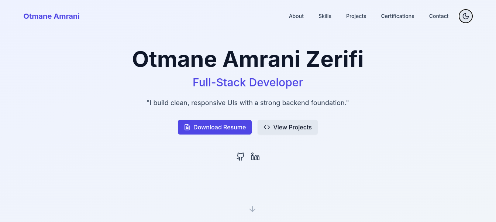

# Personal Portfolio Website

A modern, responsive portfolio website built with React, TypeScript, and Tailwind CSS, showcasing my skills and projects as a Full-Stack Developer.
---
🌍 Live Demo

 https://portfolio-eight-sage-45.vercel.app
 

## 🚀 Features

- **Responsive Design**: Fully responsive layout optimized for all device sizes
- **Dark/Light Mode**: Theme toggle with system preference detection
- **Smooth Animations**: Page transitions and scroll animations using Framer Motion
- **Modern UI**: Clean interface with Tailwind CSS styling
- **Type-Safe**: Built with TypeScript for enhanced development experience
- **Interactive Components**: Dynamic project cards and skill showcases
- **Contact Form**: Built-in contact functionality

## 🛠️ Built With

- [React](https://reactjs.org/) - Frontend library
- [TypeScript](https://www.typescriptlang.org/) - Type safety
- [Tailwind CSS](https://tailwindcss.com/) - Styling
- [Framer Motion](https://www.framer.com/motion/) - Animations
- [Vite](https://vitejs.dev/) - Build tool
- [Lucide React](https://lucide.dev/) - Icons

## 🎯 Key Sections

- **Hero**: Professional introduction and call-to-action
- **About**: Background and experience
- **Skills**: Technical expertise and tools
- **Projects**: Portfolio of work
- **Design**: UI/UX capabilities
- **Certifications**: Professional credentials
- **Contact**: Get in touch form

## 📱 Responsive Design

- Mobile-first approach
- Breakpoints for tablet and desktop
- Optimized images and assets
- Fluid typography and spacing

## 🎨 Customization

1. Update personal information in `src/data/`
2. Modify theme colors in `tailwind.config.js`
3. Add/remove sections in `App.tsx`
4. Customize animations in components

## 🌐 Deployment

The site can be deployed to any static hosting platform:

- Vercel
- Netlify
- GitHub Pages

